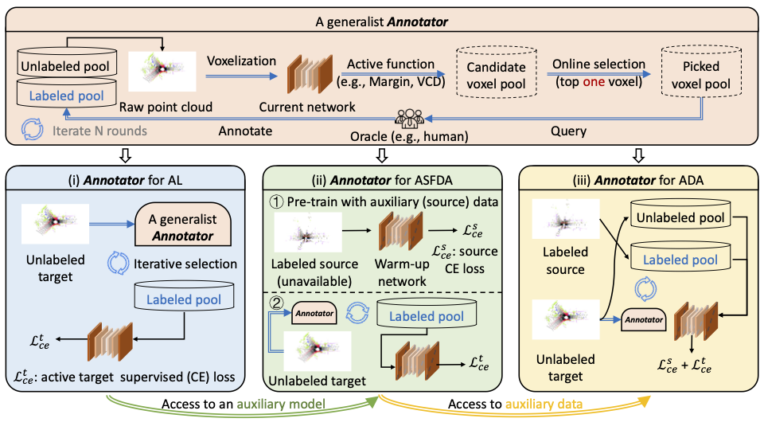

 ---

<div align="center">    
 
# Annotator for LiDAR Semantic Segmentation

[Annotator: An Generic Active Learning Baseline for LiDAR Semantic Segmentation]()  (**NeurIPS 2023**)

[Binhui Xie](https://binhuixie.github.io), [Shuang Li](https://shuangli.xyz), [Qingju Guo](https://github.com/WAAutomation), [Chi Harold Liu](https://scholar.google.com/citations?user=3IgFTEkAAAAJ&hl=en) and [Xinjing Cheng](https://scholar.google.com/citations?user=8QbRVCsAAAAJ&hl=en)


[//]: # ([![Paper]&#40;https://img.shields.io/badge/Paper-arXiv-%23B31B1B?style=flat-square&#41;]&#40;https://arxiv.org/abs/2111.12940&#41;&nbsp;&nbsp;)

[//]: # ([![Models]&#40;https://img.shields.io/badge/Model-Google-%230061FF?logo=googledrive&style=flat-square&#41;]&#40;https://drive.google.com/drive/folders/1GUGsMHnBHlk5rlkAsUq55O2GNdFF_--a&#41;&nbsp;&nbsp;)

[//]: # ([![Bilibili]&#40;https://img.shields.io/badge/Video-Bilibili-%2300A1D6?logo=bilibili&style=flat-square&#41;]&#40;https://www.bilibili.com/video/BV1oS4y1e7J5&#41;&nbsp;&nbsp;)

[//]: # ([![YouTube]&#40;https://img.shields.io/badge/Video-YouTube-%23FF0000?logo=youtube&style=flat-square&#41;]&#40;https://www.youtube.com/watch?v=kN4Kru2fL-g&#41;&nbsp;&nbsp;)

[//]: # ([![Slides]&#40;https://img.shields.io/badge/Poster-Dropbox-%230061FF?logo=dropbox&style=flat-square&#41;]&#40;https://www.dropbox.com/s/mm14k36ydirk2w8/cvpr22_poster_2x1_in-person.pdf?dl=0&#41;&nbsp;&nbsp;)



</div>

### Highlight
- 🌈 we present a voxel-centric online active learning baseline that efficiently reduces the labeling cost of enormous point clouds and effectively facilitates learning with a limited budget.
- ⚖️ we introduce a novel label acquisition strategy, voxel confusion degree (VCD), that requires 1000× fewer annotations while reaching a close segmentation performance to that of the fully supervised counterpart. 
- 🚀 `Annotator` is generally applicable and works for different network architectures (e.g., MinkNet, SPVCNN, etc.), in distribution or out of distribution setting (i.e., AL, ASFDA, and ADA), and simulation-to-real
(SynLiDAR → SemanticKITTI/SemanticPOSS) and real-to-real (SemanticKITTI → nuScenes and nuScenes → SemanticKITTI) scenarios with consistent performance gains


## Usage
Coming soon!


## Citation
If you find this project useful in your research, please consider citing:
```latex
@inproceedings{xie2023annotator,
 author = {Xie, Binhui and Li, Shuang and Guo, Qingju and Liu, Harold Chi and Cheng, Xinjing},
 booktitle = {Advances in Neural Information Processing Systems},
 title = {Annotator: An Generic Active Learning Baseline for LiDAR Semantic Segmentation},
 year = {2023}
}

```

## Contact

For help and issues associated with Annotator, or reporting a bug, please open a [[GitHub Issues](https://github.com/BIT-DA/Annotator/issues/new)], or feel free to contact [binhuixie@bit.edu.cn](mailto:binhuixie@bit.edu.cn).
